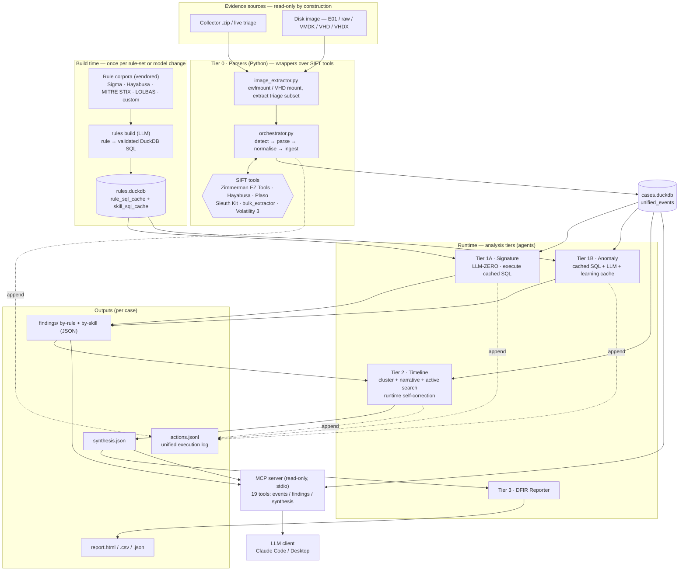
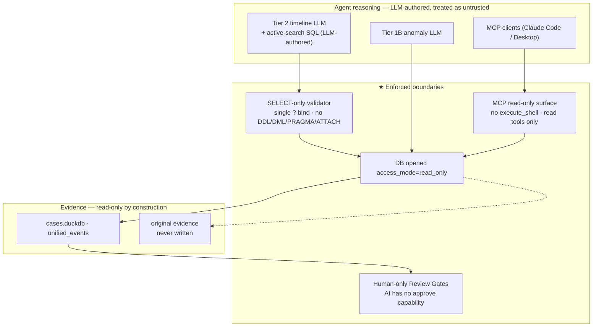
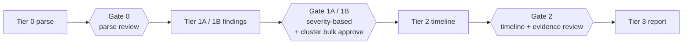
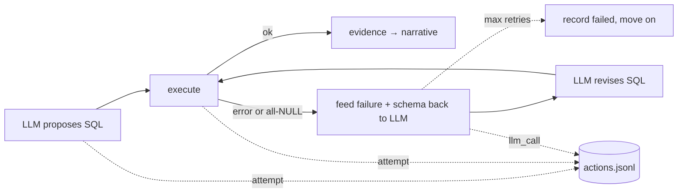

# TLVB — Architecture

*Timeline Longa, Vita Brevis* — an autonomous **Windows disk-forensics** IR
agent that runs on a Linux terminal / SIFT Workstation.

**Scope.** TLVB analyzes **disk-resident** Windows artifacts acquired as a triage
collection or disk image (E01 / raw / VMDK / VHD / VHDX) — see the evidence
sources in §1. Live **memory forensics** and **network / packet (PCAP)
forensics** are out of scope by default; memory- and Sysmon-dependent rules stay
disabled unless those artifacts are present in the evidence.

This document is the **architecture diagram** for the FIND EVIL! submission. It
shows how the **evidence sources**, **SIFT tools**, **analysis agents**, the
**MCP server**, and the **output pipeline** connect, and — most importantly —
where the **security boundaries** are enforced. Diagrams are Mermaid (rendered
inline on GitHub).

---

## 1. End-to-end pipeline

The defining idea is a **split between build time and runtime**: an LLM compiles
detection rules into SQL *once* (build time); at runtime the signature tier
executes that cached SQL with **no LLM call at all**, and LLM reasoning is
concentrated in the anomaly and timeline tiers.

**Reading it:** evidence flows down the left into Tier 0, which drives the SIFT
tools and writes normalised events to `cases.duckdb`. The build-time column
(amber idea) compiles rule corpora into `rules.duckdb` independently. At runtime
the four tiers consume the case DB (+ the SQL cache) and produce findings →
synthesis → report. Every tier also appends to one ordered `actions.jsonl`
audit log. The MCP server is a **read-only** surface an external LLM client can
query.

---

## 2. Security boundaries (enforced in code, not prompt)

The judging criteria favour **architectural** guardrails over prompt-level ones.
In TLVB the agent/LLM side is treated as untrusted; every path it has to the
evidence passes through a boundary enforced in Go, and the original evidence is
never mutated.

| Boundary | Where | Enforcement |
|---|---|---|
| **Tier 1A is LLM-free at runtime** | `internal/tier1a/` | runtime never calls an LLM — fixed cost, reproducible output. LLM only runs at build time. |
| **Read-only case DB** | `internal/casedb/` | analysis opens DuckDB with `access_mode=read_only`. |
| **Original evidence never mutated** | Tier 0 staging | parsers read a staged copy; outputs go only to `outputs/cases/<id>/`. |
| **active-search SQL is SELECT-only** | `internal/tier2/active_search.go` | validator: must start `SELECT`/`WITH`, exactly one `?` bind, rejects `INSERT/UPDATE/DELETE/DROP/ALTER/ATTACH/PRAGMA/COPY`. |
| **MCP is read-only** | `internal/mcp/` | no `execute_shell`; all tools are read-only; DB opened read-only. |
| **AI cannot self-approve** | Review Gates | findings are produced as reviewable state; approve/reject is a human action via the Review UI / CLI, not an agent capability. |

---

## 3. Human-in-the-loop review gates

Review is staged between tiers so an Examiner validates before conclusions
propagate. Severity drives a default (critical/high require review; medium/low
auto-approve) that the Examiner can always override.

---

## 4. Self-correction & audit trail (runtime autonomy)

When Tier 2 active-search proposes a query that fails validation, errors in
DuckDB, or returns all-NULL projections, the failure + the real schema are fed
back to the LLM, which revises the SQL and re-runs it (bounded retries). Each
attempt is streamed to `actions.jsonl` in true chronological order, so the
**error → revise → recover** sequence is auditable.

The same `actions.jsonl` also records Tier 0 parse activity, Tier 1A signature
hits (`rule_sql`), and Tier 1B / Tier 2 LLM calls with token/cost — one ordered
log per case spanning the whole investigation.

---

## 5. Component → code map

| Layer | Package / path | Role |
|---|---|---|
| Tier 0 parsers | `parsers/` | SIFT-tool wrappers → unified events (Python) |
| Case store | `internal/casedb/` | `cases.duckdb` (events, findings refs) |
| Rule ingest | `internal/rulesrepo/` | load Sigma / Hayabusa / STIX / LOLBAS |
| Rule build | `internal/rulebuild/`, `internal/rulesdb/` | rule → SQL cache (`rules.duckdb`) |
| Tier 1A | `internal/tier1a/` | signature runtime (LLM-zero) |
| Tier 1B | `internal/tier1b/` | anomaly + learning skill cache |
| Tier 2 | `internal/tier2/` | timeline + active search + self-correction |
| Tier 3 | `internal/tier3/` | DFIR report (HTML/CSV/JSON) |
| Audit log | `internal/auditlog/` | unified `actions.jsonl` |
| Completeness | `internal/completeness/` | data-gap vs detection-failure |
| MCP | `internal/mcp/` | read-only tool surface |
| Web UI | `internal/web/`, `ui/` | dashboard + Review Gates + Audit tab |

**Legacy packages.** `internal/agents/`, `internal/synthesizer/` and
`internal/reporter/` are the shared-foundation predecessors of Tiers 1B/2/3
(see `NEW_CONTRIBUTIONS.md`). They remain only to serve the legacy `--tactic`
analysis path and are not part of the TLVB pipeline described above.

See `NEW_CONTRIBUTIONS.md` for what is new hackathon work vs. reused foundation.
